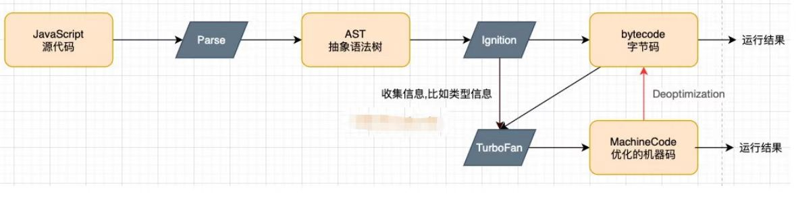

## v8 解析 js 流程



## 解析

```js
var name = 'why';

foo();

function foo() {
  var num = 1;
  console.log('foo');
}

var num1 = 20;
var num2 = 30;
var result = num1 + num2;
```

- 1.代码被解析,v8 引擎内部会帮助我们创建一个全局对象(GlobalObject => GO),里边存放的是全局函数(setTimeout、Math、Number 等)

当解析有函数时,会单独开辟一块堆空间去存储函数,内部的`[[scope]]`会包含它的父级作用域(此处父级作用域是全局作用域,包含当前函数的 VO 以及父级的 VO),还会存储函数的执行体(代码块),同时会把函数内部的变量放入函数 AO 中

```js
// 伪代码
var GlobalObject = {
  String: '类',
  Date: '类',
  setTimeout: '函数',
  window: globalObject,
  foo:'对应函数的内存地址'，
  name: undefined,
  num1: undefined,
  num2: undefined,
  result: undefined,
};
```

- 2.运行代码

v8 内部会有一个执行上下文栈(Execution Context Stack, ECStack)(函数调用栈)。在执行全局代码时,需要创建全局执行上下文(Global Execution Content)(全局代码执行是创建),此时在 GEC 内部有一个 VO(variable Object)变量对象,指向 GO

执行函数 foo()时,会创建函数执行上下文(FEC),此时内部的 VO 指向的是 AO(活跃对象)(用于储存函数的内部变量,执行时创建),当函数执行完，函数执行上下文就会销毁,AO 也会销毁

- 3.执行代码

## 示例

```js
var a = 'a';

function foo() {
  console.log(a);
}

function fn() {
  var a = 'b';
  foo();
}
fn();

function fn1() {
  var a = 'b';
  function foo1() {
    console.log(a);
  }
  foo1();
}
fn1();
// a b
```

解析

- 在进行函数预编译的时候,内部的`[[scope]]`存的父级 VO 是 window,打印 a

## 注意

- AO\GO,全局 VO 对应 GO,函数内 VO 对应 AO,这些概念都是在 ECMAScript5 以前
- ES6 之后被改为变量环境和环境记录,在执行代码中变量和函数的声明会作为环境记录(不在局限于以前的对象)添加到变量环境中
