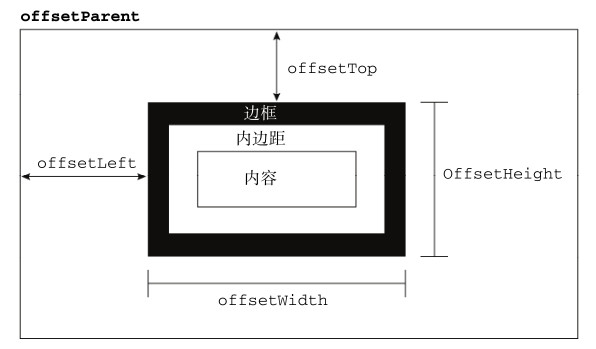

# 每天一个小知识点
## 第十一天 
---
## 1、组合式继承的缺点,寄生继承的缺点
组合继承: 由于我们是以父级的实例来作为子类型的原型,所以调用了两次超类的构造函数,造成子类的原型中多了很多不必要的属性.导致原型对象被父级实例属性污染,出现属性冗余问题
```js
function Father(name) {
  this.name = name
}
Father.prototype.say = function(){
  console.log(console.log(`hello大家好，我是${this.name}今年${this.age}岁了`))
}
function Son(name, age) {
  this.age = age
  Father.call(this, name)
}
Son.prototype = new Father()  // 将父子方法建立关系，为了复用prototype属性
var xrr = new Son('dada')
srr.say()
```
寄生继承: 没有调用父类的构造函数,而只能够继承原型中的方法,所以没有办法实现函数的复用.
```js
function People(obj) {
  function F() {}
  F.prototype = obj
  return new F()
}

function Student(obj) {
  let clone = Pelope(obj) // 通过调用函数创建一个新对象
  clone._proto_.long = '120'
  clone._proto_.getAA = function() {
    console.log('aaaa')
  }
  clone.say = function() {
    conmsole.log(`hello大家好，我是${this.name}今年${this.age}岁了`)
  }
  return clone 
}

var obj = {
  name: 'dada',
  age: '12'
}
var xrr = Student(obj)
xrr.say()
```
## 2、function构造函数和class的区别
class事实上是一种特殊的function,class语法也有两种形式：class表达式和class声明  
1、Function构造函数：可以实例化函数对象,function声明会变量提升  
2、class不会变量提升,需要先声明再使用

## 3、怎么计算元素ele到浏览器视口顶部的距离
```js
let sum = 0
let ele = xxx // 要求距离的元素
while(ele.offsetParent) {
	sum += ele.offsetTop; // 统计当前到其有定位元素的距离
	ele = ele.offsetParent; // 将父设为当前继续求距离
}
// 输出到视口顶部距离
console.log(sum)
```

## 4、prop和attribute的区别
propetry是js原生对象的直接属性,是dom元素在js中作为对象拥有的属性  
attribute是dom元素在文档中作为html标签拥有的特性,他的值只能够是字符串,attributer是属于property的一个子集  
对于html的标准属性来说,两者是同步的,会自动更新,但对于自定义属性来说,两者是不同步的
相关资源: <https://www.cnblogs.com/lmjZone/p/8760232.html>
## 5、事件冒泡是事件捕获
捕获阶段 -> 目标阶段 -> 冒泡阶段
比如点击了某个input框，从window 到 body 是捕获阶段（捕获从外向里），到input是目标阶段(到达目标阶段)，再到body到window是冒泡阶段(冒泡从里向外);ie规定先让他冒泡，addEventListener 第三个参数就代表的是冒泡还是捕获，默认是false代表默认冒泡
