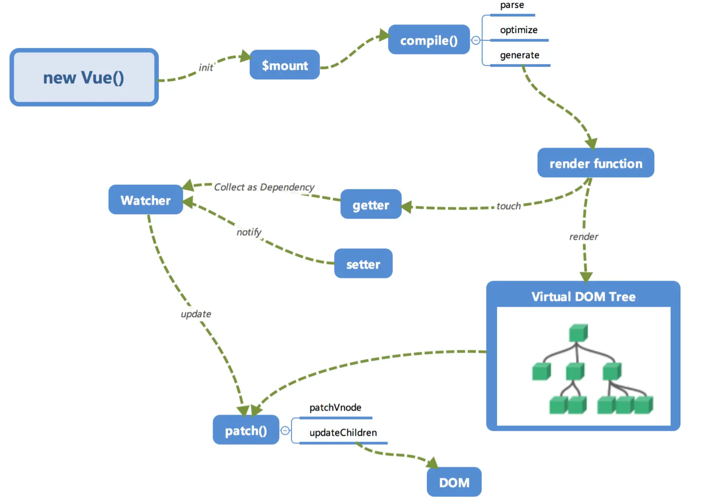
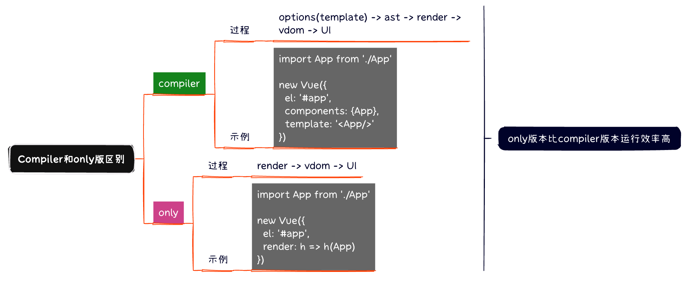

## 内部流程

## 初始化及挂载
- 在`new vue()`之后,会调用`_init`函数进行初始化,初始化生命周期、事件、props、methods等
- 初始化之后调用`$mount()`会挂载组件,如果是运行时编译(即不存在`render()`,但是存在`template`情况下,则需要编译)
## 编译
compile编译可分为`parse、optimize、generate`三个阶段,最终得到`render()`
- `parse`会用正则等方式解析template模板中的指令、class、style等数据,形成AST
- `optimize`用来标记static静态节点。编译过程中的一处优化,当`update`更新界面时,会有一个`patch`过程,diff算法会直接跳过静态节点,从而减少了比较的过程,优化`patch`性能
- `generate`将AST转化为`render()`字符串的过程
#### compiler和only版对比
  
**？？？为什么compiler版得先生成ast树在编译成render函数？？？**\
**整个过程中AST树只生成一次($mount执行了一次),render也只生成了一次.整个过程中就是html中的一个标签,转化成render函数的代码,肯定要用一些变量来描述这个标签,例如有没有v-if,有没有v-for等等,然后根据这些变量信息去判断改如何生成render函数,所以选择ast节点作为变量来描述这个源码标签的信息,然后判断这些信息就知道了如何生成render函数**
## 响应式
- 利用`Object.defineProperty`对对象进行`setter`和`getter`拦截
- 当`render()`被渲染的时候,读取所需对象的值时,会触发`getter`函数进行**依赖收集**、**依赖收集的目的是将观察者Watcher对象存放在当前闭包中的订阅者Dep的subs中**
- 在修改对象值得时候,会触发`setter`,`setter`通知之前依赖收集得到的Dep中的每一个Watcher当前值发生了变化,需要重新渲染视图,这时候这些Watcher就会开始调用`update`来更新视图,在此过程中还有一个`patch`的过程以及使用队列来异步更新的策略

## Virtual DOM
Virtual DOM其实就是一棵以js对象(VNode)作为基础的树,用对象来描述节点,实际上只是一层对真实DOM的抽象

## 更新视图
将新的VNode与旧的VNode一起传入`patch`进行比较,经过diff算法得出他们的差异,最后只对这些差异的对应DOM进行修改即可